# 部署指南 (Windows)

## 1. 环境要求

项目       要求
---------- ---------------------------------------------
操作系统   Windows Server 2019 / 2022 或 Windows 10/11
CPU        ≥ 4 Core
内存       ≥ 8GB
磁盘       ≥ 50GB
软件       Docker Desktop (包含 Docker Compose)

安装 Docker Desktop：\
https://www.docker.com/products/docker-desktop/

验证安装：

``` powershell
docker -v
docker compose version
```

------------------------------------------------------------------------

# 2. 执行镜像拉取命令（前提已安装docker和docekr-compose）

```shell
docker-compose up -d
```
等待镜像下载完成并运行

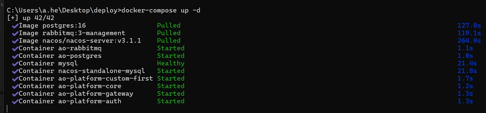

------------------------------------------------------------------------

# 3. 导入配置

打开DockerDesktop找到已运行的容器：
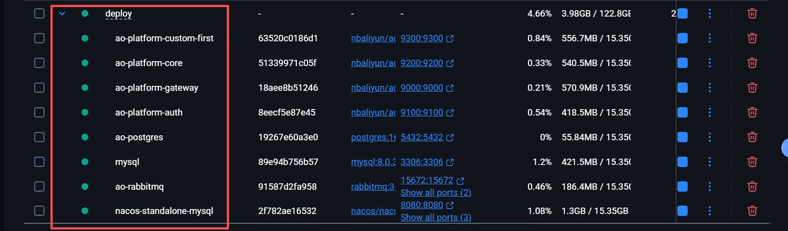

点击8080端口进入NACOS控制台

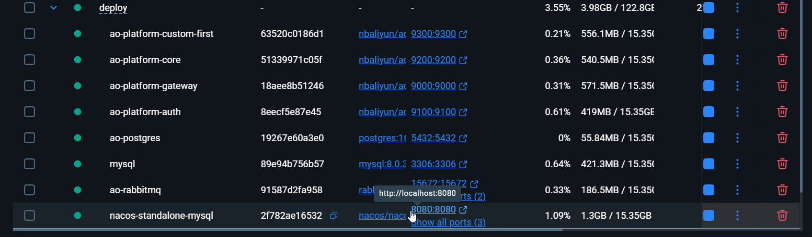

登录NACOS
- 用户名：nacos
- 密&emsp;码：nacos
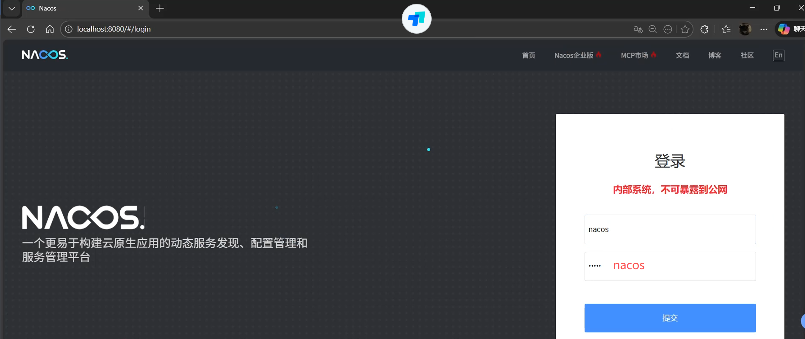

导入配置文件

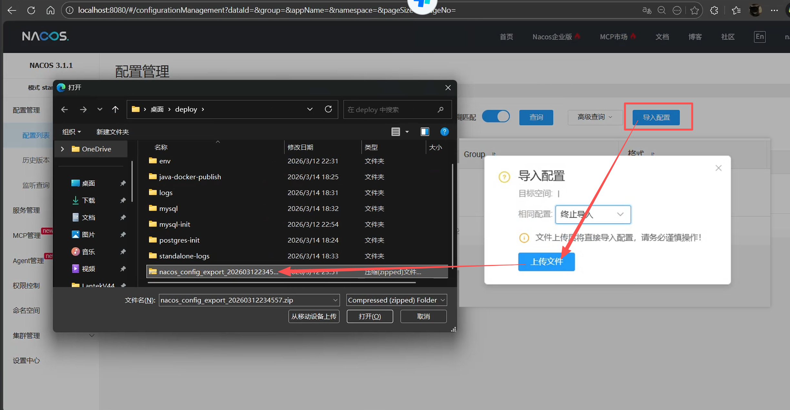

# 4. 修改接口地址和套料软件数据库参数 
编辑 `ao-platform-custom-dev` 修改如下参数，并发布
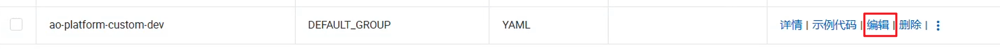
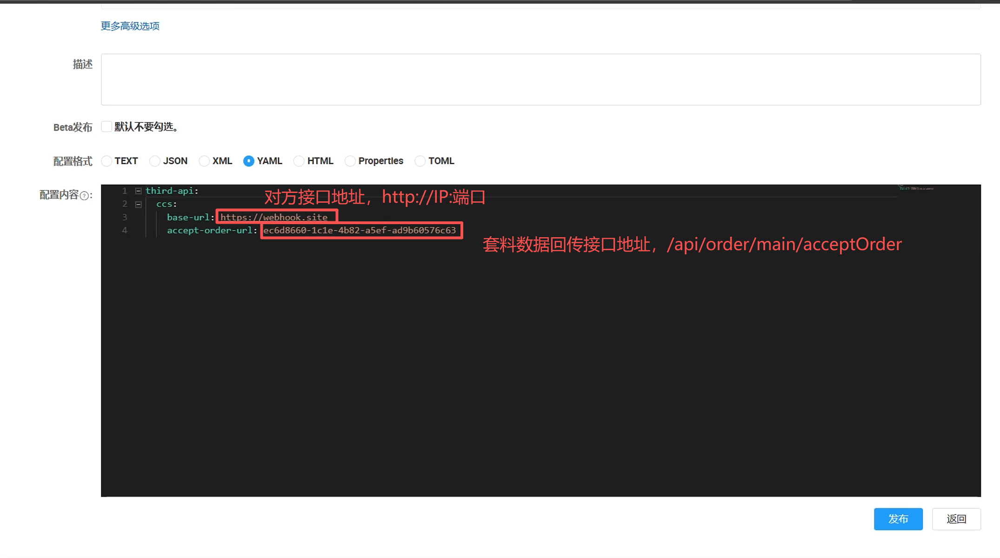
编辑 `ao-platform-core-dev` 修改数据库，服务地址，用户名，密码，并发布
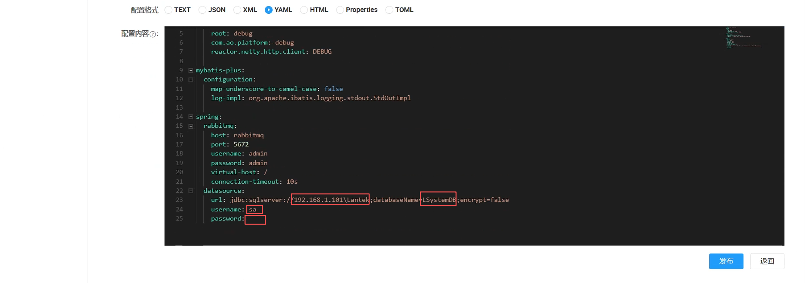

# 5. 配置文件如有修改的情况，需要重启相关服务
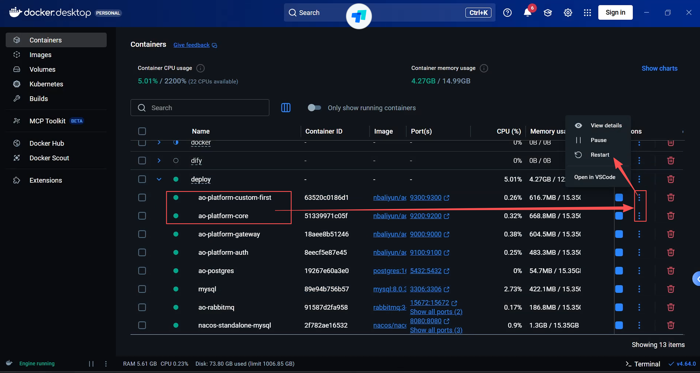

# 6. 如果需要验证部署后服务是否正常工作
可以使用这个公网接口服务做测试
```http
https://webhook.site/
```
设置接口响应报文

1. Content type: `application/json`

2. Content

   ```json
   {
   "code":0,
   "message":"",
   "data":true
   }
   ```


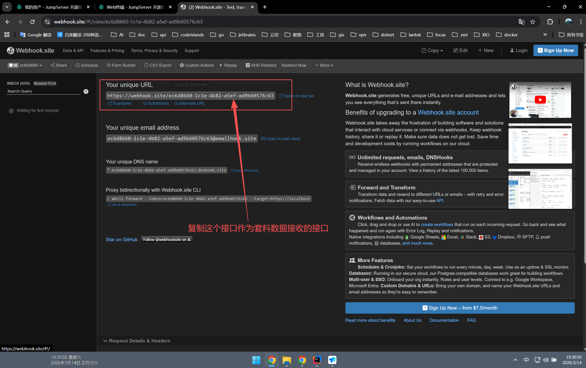

- 复制截图中的接口，然后配置到`ao-platform-custom-dev`服务中，并重启服务
- 打开套料软件，并将某个程序另存为送车间（差不多30秒内，刷新截图中的webhook.site网址）
- 正常情况下就能看到请求发送的报文
- 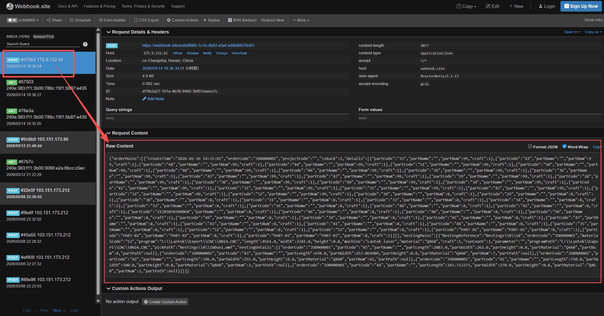

> 注意：这个 `https://webhook.site/`网站中接口请求次数有限制，只能测试几次。
